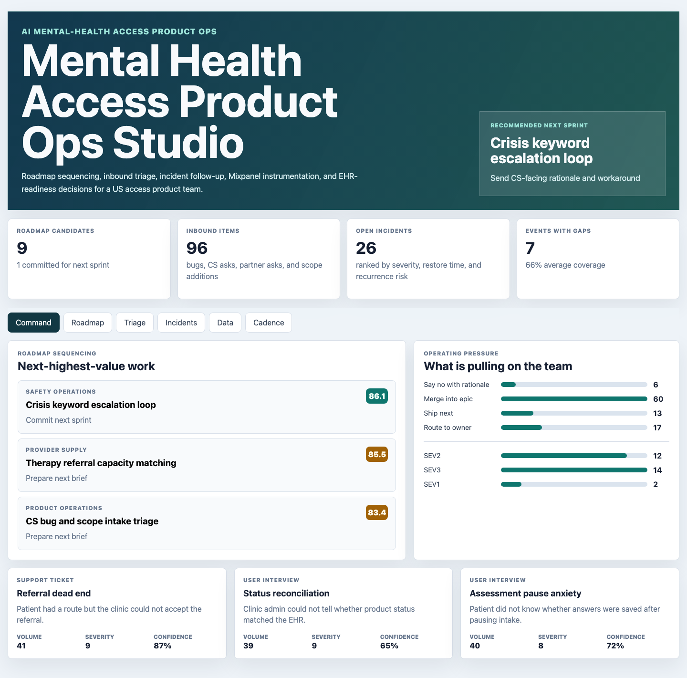

# Mental Health Access Product Ops Studio

An interactive Product Ops portfolio artifact for an AI-powered mental-health access product scaling in the US market. The studio shows how a product manager can run roadmap sequencing, inbound triage, incident follow-up, instrumentation review, and EHR-readiness decisions without turning every customer ask into engineering churn.



## What This Project Demonstrates

- Roadmap prioritization grounded in customer signal, usage behavior, support pressure, incident risk, effort, and clinical-safety sensitivity.
- Product ceremonies with follow-up owners, overdue actions, and decision artifacts.
- Inbound triage that separates bugs, data debt, CS asks, partner requests, and scope additions.
- Incident loops with severity, root cause, restore time, recurrence risk, and follow-up owner.
- Mixpanel-style event instrumentation that makes funnel and product behavior answerable by the team.
- FHIR and HL7 readiness thinking for EHR-adjacent referral status workflows.

## Data Sources

- `data/product_workflows.csv` - `9` roadmap candidates
- `data/weekly_operating_metrics.csv` - `108` workflow-week access rows
- `data/customer_feedback.csv` - `72` customer and partner signal rows
- `data/inbound_triage.csv` - `96` bug, CS, partner, scope, and data-debt rows
- `data/incident_log.csv` - `28` incident loop records
- `data/instrumentation_events.csv` - `27` Mixpanel-style event contracts
- `data/ehr_integration_readiness.csv` - `9` EHR integration readiness contracts
- `data/ceremony_followups.csv` - `20` PM operating ceremony records

## Analysis Outputs

- `analysis/outputs/roadmap_priority_queue.csv`
- `analysis/outputs/inbound_triage_queue.csv`
- `analysis/outputs/incident_followup_queue.csv`
- `analysis/outputs/instrumentation_gap_queue.csv`
- `analysis/outputs/ehr_readiness_queue.csv`
- `analysis/outputs/project_briefs.csv`
- `analysis/outputs/app_payload.json`
- `analysis/executive_findings.md`
- `analysis/analysis_plan.md`
- `analysis/methodology.md`
- `analysis/sql_checks.sql`

## Current Recommendation

Commit next sprint to **Crisis keyword escalation loop**. It has the highest priority score (`86.1`), estimated access impact of `$209,860`, and the strongest overlap between access outcomes, incident pressure, and instrumentation gaps.

## Run Locally

```bash
npm run analyze
npm run start
```

Then open `http://localhost:4173`.

## Portfolio Framing

This is a public portfolio artifact with reproducible synthetic data and transparent rules-based scoring. It does not connect to live product analytics, EHRs, support systems, patient records, partner clinics, or production AI models. It demonstrates how a Product Manager can translate customer signal, engineering constraints, incident loops, and instrumentation quality into an actionable operating cadence.
